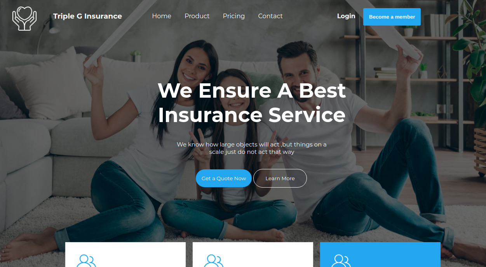
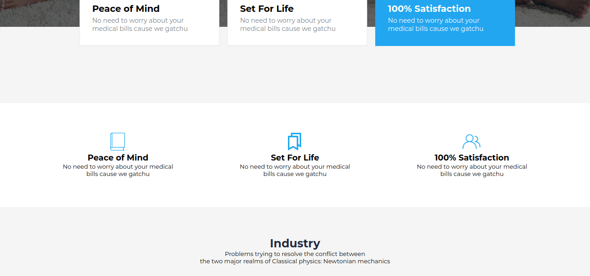
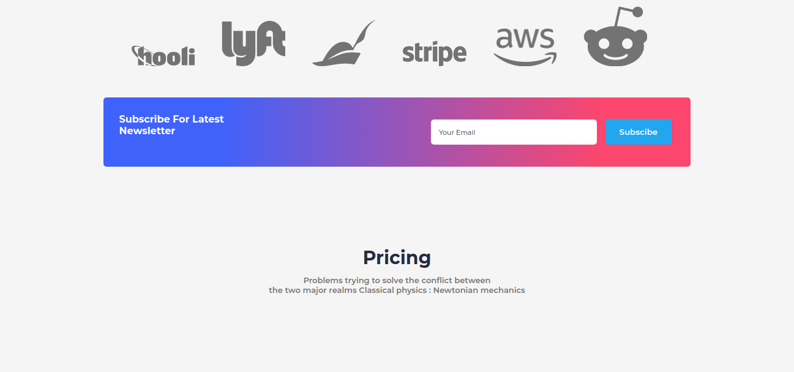
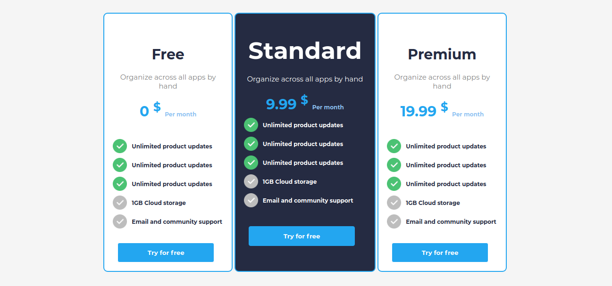
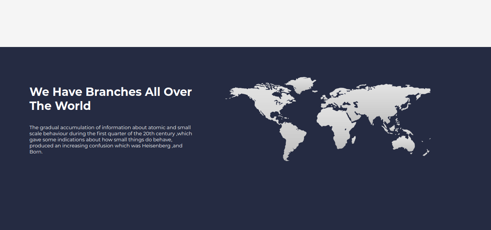
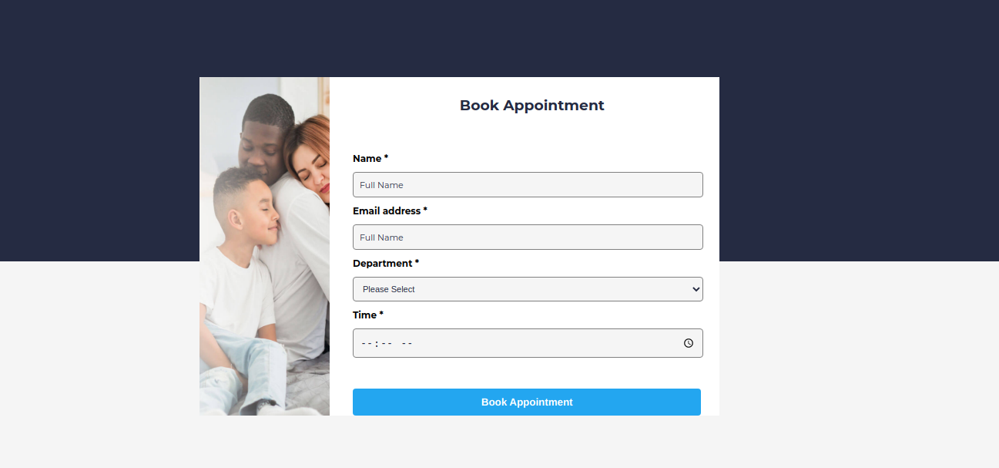

# Burger Palace website
#### 30/01/2022
This is a basic html/css website for a n Insurance Company by the name Triple G
#### By 
Geoffrey Gichaga .G

## Table of Content

+ [Description](#description)
+ [Installation Requirement](#Installation)
+ [Known Bugs](#Known-Bugs)
+ [Technology Used](#technology-used)
+ [Support and Contact Details](#Support-and-contact-details)
+ [Licence](#licence)
+ [Authors Info](#author-Info)

## Description
The site provides users with information about our company ,various insurance packages ,reviews from our clients and An appointment booking form 
It has 7 sections on the landing page each with different information.
with the following view on a desktop mode display:
### Banner

### Company Goals 

### Reviews and some of our Patnering Companies

### Newsletter Subscription 

### Package Pricing

### Appointment Booking Form 

### Footer and Credit section 

 

## Setup/Installation Requirements
* SIte can be accessed through this link https://geoffreygichaga.github.io/Burger-Palace/
* A phone .tablet or a desktop computer
* Site is responsive to screens of upto 1200px

## Known Bugs
The site is not responsive for screens larger that 1200px

## Technologies Used
Languages used in developing this site include:
* HTML 
* CSS
## Support and contact details
You can report any issue you encounter with the site on :geoffrey.githinji@student.moringaschool.com
### License
MIT License

Copyright (c) [2022] [Geoffrey Gichaga .G]

Permission is hereby granted, free of charge, to any person obtaining a copy
of this software and associated documentation files (the "Software"), to deal
in the Software without restriction, including without limitation the rights
to use, copy, modify, merge, publish, distribute, sublicense, and/or sell
copies of the Software, and to permit persons to whom the Software is
furnished to do so, subject to the following conditions:

The above copyright notice and this permission notice shall be included in all
copies or substantial portions of the Software.

THE SOFTWARE IS PROVIDED "AS IS", WITHOUT WARRANTY OF ANY KIND, EXPRESS OR
IMPLIED, INCLUDING BUT NOT LIMITED TO THE WARRANTIES OF MERCHANTABILITY,
FITNESS FOR A PARTICULAR PURPOSE AND NONINFRINGEMENT. IN NO EVENT SHALL THE
AUTHORS OR COPYRIGHT HOLDERS BE LIABLE FOR ANY CLAIM, DAMAGES OR OTHER
LIABILITY, WHETHER IN AN ACTION OF CONTRACT, TORT OR OTHERWISE, ARISING FROM,
OUT OF OR IN CONNECTION WITH THE SOFTWARE OR THE USE OR OTHER DEALINGS IN THE
SOFTWARE.

### Copyright (c) {year}
copyright (c) 2022.All rights reserved.

## Authors Info
LinkedIn - [Geoffrey Gichaga .G](https://www.linkedin.com/in/geoffrey-gichaga-234318ba/)

